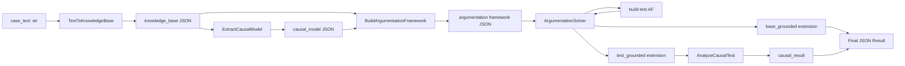
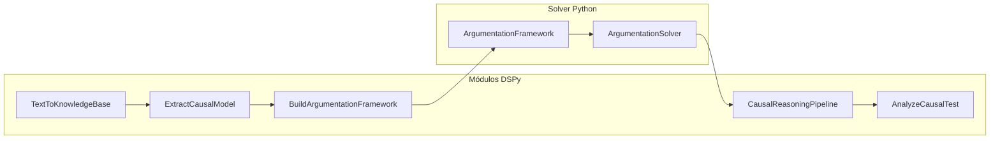

# Arquitetura: DSPy + Argumentação Defeasible para Causa-em-Fato

Este documento descreve a arquitetura de um sistema híbrido que combina módulos DSPy (para estruturar e guiar LLMs) com um solver formal de argumentação defeasible (para calcular extensões justificadas). O objetivo é transformar descrições em prosa de casos de direito do consumidor em conclusões formais sobre causa-em-fato, seguindo o framework ASPIC+ de argumentação estruturada.

## Visão Geral

O sistema implementa um pipeline que processa casos jurídicos através de múltiplas etapas de transformação, desde texto em prosa até uma conclusão formal sobre relações de causa-em-fato. A arquitetura combina a flexibilidade de LLMs (via DSPy) com a precisão formal de um solver de argumentação.

### Fluxo Principal

```
Texto do Caso → Extração de Base de Conhecimento → Modelagem Causal 
              → Construção de Framework de Argumentação → Cálculo de Extensão Fundamentada 
              → Análise Causal Contrafactual → Resultado Final
```

Cada etapa transforma a representação do caso:
1. **Extração**: Texto em prosa → Base de conhecimento estruturada (premissas, causas potenciais, conclusão alvo)
2. **Modelagem**: Base de conhecimento → Modelo causal (regras defeasible, preferências)
3. **Argumentação**: Modelo causal → Framework de argumentação completo (argumentos, ataques, derrotas)
4. **Solução**: Framework → Extensão fundamentada (argumentos justificados)
5. **Análise**: Extensão fundamentada → Julgamento causal (é causa-em-fato?)

## Componentes e Responsabilidades

### DSPy Signatures (`src/signatures.py`)

As assinaturas DSPy definem os contratos de entrada/saída entre módulos, garantindo modularidade e testabilidade:

- **`TextToKnowledgeBase`**: Extrai base de conhecimento estruturada do texto do caso
  - Entrada: texto em prosa do caso
  - Saída: JSON com premissas, causas potenciais, conclusão alvo e axiomas

- **`ExtractCausalModel`**: Identifica regras causais defeasible e preferências
  - Entrada: base de conhecimento estruturada
  - Saída: JSON com regras defeasible, undercutters, regras estritas e preferências

- **`BuildArgumentationFramework`**: Constrói framework completo de argumentação
  - Entrada: base de conhecimento e modelo causal
  - Saída: JSON com argumentos, ataques e derrotas

- **`AnalyzeCausalTest`**: Analisa testes contrafactuais para determinar causa-em-fato
  - Entrada: argumento justificado, conjunto de suporte, causa potencial
  - Saída: julgamento causal (booleano) e explicação textual

### Solver de Argumentação (`src/solver.py`)

Implementação do framework ASPIC+ que calcula extensões justificadas:

- **`Literal`**: Representa literais (fatos atômicos e suas negações)
- **`Rule`**: Representa regras defeasible e estritas (premissas → conclusão)
- **`Argument`**: Representa argumentos como cadeias de inferência
- **`Attack`**: Representa ataques entre argumentos (undermine, undercut, rebut)
- **`ArgumentationFramework`**: 
  - Constrói argumentos a partir de premissas e regras (iteração até ponto fixo)
  - Identifica ataques entre argumentos
  - Calcula derrotas com base em preferências/força dos argumentos
  - Expõe `compute_grounded_extension()` para calcular a extensão fundamentada

### Pipeline (`src/modules.py`)

- **`CausalReasoningPipeline`**: Orquestra todo o processo end-to-end
  - Integra módulos DSPy em sequência
  - Coordena extração, modelagem, argumentação e análise causal
  - Retorna resultados estruturados em JSON

- **`ArgumentationSolver`**: Integra o solver formal como ferramenta DSPy
  - Wrapper que permite o solver ser usado dentro do pipeline DSPy
  - Converte entre formatos JSON e estruturas internas do solver

### Runner (`src/pipeline.py`)

Script principal que:
- Configura ambiente e logging
- Carrega dataset de casos de exemplo
- Executa análises e validações
- Gera relatórios detalhados em JSON

## Diagramas de Arquitetura

### Fluxo do Pipeline



### Estrutura de Componentes



## Contratos de Dados

### TextToKnowledgeBase → knowledge_base (JSON)

```json
{
  "premises": ["Produto_Anunciado_AprovaAgua", "Produto_Caiu_Piscina", ...],
  "potential_causes": ["Produto_Anunciado_AprovaAgua", ...],
  "target_conclusion": "Dever_Reparo",
  "axioms": [...]
}
```

### ExtractCausalModel → causal_model (JSON)

```json
{
  "defeasible_rules": [
    {"id": "r1", "premises": [...], "conclusion": "..."},
    ...
  ],
  "undercutter_rules": [...],
  "strict_rules": [...],
  "preferences": {"r1": "r2", ...}
}
```

### BuildArgumentationFramework → af_json (JSON)

```json
{
  "knowledge": [...],
  "arguments": [
    {"id": "A1", "premises": [...], "conclusion": "...", "rules": [...]},
    ...
  ],
  "attacks": [
    {"from": "A2", "to": "A1", "type": "undercut"},
    ...
  ],
  "defeats": [...]
}
```

### ArgumentationSolver → (grounded_extension JSON, explanations JSON)

```json
{
  "grounded_extension": ["A1", "A3", ...],
  "explanations": {
    "A1": {"support_set": [...], "defeated_by": []},
    ...
  }
}
```

### AnalyzeCausalTest → causal_result

```json
{
  "is_cause": true,
  "causal_explanation": "O fato 'Produto_Anunciado_AprovaAgua' é causa-em-fato porque...",
  "defeated_chain": [...]
}
```

## Exemplo de Execução

### Caso: Celular à Prova d'Água

**Texto do caso:**
> "Comprei um celular online anunciado como à prova d'água. Caiu na piscina e parou de funcionar. A empresa se recusa a consertar alegando mau uso."

**Base de conhecimento extraída:**
- Premissas: `Produto_Anunciado_AprovaAgua`, `Produto_Caiu_Piscina`, `Produto_Parou_Funcionar`, `Empresa_Alegou_Mau_Uso`, `Empresa_Recusou_Conserto`
- Causa potencial: `Produto_Anunciado_AprovaAgua`
- Conclusão alvo: `Dever_Reparo`

**Regras causais identificadas:**
- `r1`: `Produto_Anunciado_AprovaAgua` → `Produto_Defeituoso`
- `r2`: `Produto_Defeituoso` → `Dever_Reparo`
- `r3`: `Empresa_Alegou_Mau_Uso` → `Nao_Aplica_Garantia` (undercuts r2)

**Argumentos construídos:**
- `A1`: `[Produto_Anunciado_AprovaAgua, r1, r2]` → `Dever_Reparo`
- `A2`: `[Empresa_Alegou_Mau_Uso, r3]` → `Nao_Aplica_Garantia`
- Ataque: `A2` undercuts `A1`

**Extensão fundamentada:**
O solver calcula quais argumentos são justificados. Se `A2` derrota `A1`, então `A1` não estará na extensão fundamentada, e `Produto_Anunciado_AprovaAgua` não será considerado causa-em-fato para `Dever_Reparo`.

## Dataset de Casos

O projeto inclui um dataset de casos sintéticos (`src/dataset.py`) que cobre diferentes cenários:

1. **Undercutting**: Empresa alega mau uso (caso do celular)
2. **Causa direta simples**: Entrega atrasada
3. **Conflito de regras**: Defeito oculto vs. garantia expirada
4. **Preempção**: Múltiplas causas concorrentes
5. **Vício de informação**: Publicidade enganosa

Cada caso inclui:
- Texto do caso
- Base de conhecimento esperada
- Modelo causal esperado
- Resultado causal esperado

## Estrutura de Arquivos

```
src/
├── dataset.py          # Dataset de casos de exemplo
├── signatures.py       # Assinaturas DSPy (contratos entre módulos)
├── modules.py          # Pipeline e módulos DSPy
├── solver.py          # Solver de argumentação ASPIC+
└── pipeline.py         # Script runner principal
```

## Considerações de Design

### Escolha da Semântica Grounded

A implementação utiliza a semântica grounded por:
- **Garantia de existência e unicidade**: Sempre existe uma única extensão fundamentada
- **Natureza cética**: Apropriada para raciocínio judicial onde incerteza é comum
- **Computação eficiente**: Algoritmo de ponto fixo é computacionalmente tratável

### Integração DSPy + Solver

O solver é integrado como uma ferramenta DSPy (`dspy.Tool`), permitindo:
- Uso dentro de cadeias de raciocínio DSPy
- Validação automática de tipos e formatos
- Composição modular com outros módulos

### Análise Contrafactual

Para determinar causa-em-fato, o sistema:
1. Calcula extensão fundamentada do caso base
2. Para cada causa potencial, constrói um teste contrafactual (nega a causa)
3. Compara extensões fundamentadas para determinar se a causa é necessária
