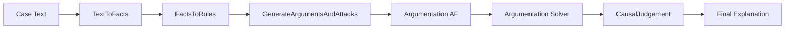

## Arquitetura: DSPy + Argumentação Defeasible para Causa-em-Fato

Esta arquitetura propõe um pipeline híbrido que combina módulos DSPy (para estruturar e guiar LLMs) com um solver formal de argumentação (para calcular extensões justificadas). O objetivo é transformar descrições em prosa de casos de direito do consumidor em conclusões formais sobre causa-em-fato, seguindo as ideias do artigo "Modelling Cause-in-Fact in Legal Cases through Defeasible Argumentation".

Fluxo geral (resumido):

- Texto do caso -> Extração de fatos atômicos
- Fatos -> Identificação de regras causais possíveis (regras defeasible)
- Fatos + Regras -> Geração de argumentos e identificação de ataques (rebutting / undercutting)
- Exportar a estrutura abstrata de argumentação (AF) para um solver Python
- Solver calcula argumentos justificados (ex.: grounded extension) e conjuntos de suporte mínimos
- Resultado -> Módulo DSPy que gera a explicação final: julgamento causal (é causa-em-fato? por quê)

## Componentes e responsabilidades

- TextToFacts (DSPy) — converte texto em fatos atômicos e eventos, ordenados cronologicamente.
- FactsToRules (DSPy) — sugere regras causais defeituais relevantes a partir dos fatos.
- GenerateArgumentsAndAttacks (DSPy) — constrói argumentos (cadeias de inferência) e identifica ataques entre argumentos.
- Argumentation Solver (Python) — recebe o AF (lista de argumentos e ataques) e calcula a extensão fundamentada / justificação formal.
- CausalJudgement (DSPy) — interpreta a saída do solver e produz uma explicação humana-compatível sobre se um fato é causa-em-fato.

## Exemplo conciso de Signatures (pseudo-Python / documentação)

Estas assinaturas servem como contrato entre módulos DSPy e tornam o pipeline modular e testável.

```python
class TextToFacts(dspy.Signature):
		"""Converts a case description into structured facts and events."""
		case_description = dspy.InputField(desc="Texto completo do caso.")
		structured_facts = dspy.OutputField(desc="Lista de fatos atômicos (strings), ex: ['ProdutoDefeituoso', 'ConsumidorReclamouEmX'].")

class FactsToRules(dspy.Signature):
		"""Identifies potential defeasible causal rules from facts."""
		structured_facts = dspy.InputField(desc="Lista de fatos atômicos.")
		causal_rules = dspy.OutputField(desc="Lista de regras no formato 'r1: [premise1, ...] => conclusion'.")

class GenerateArgumentsAndAttacks(dspy.Signature):
		"""Generates arguments (chains) and identifies attacks (rebut, undercut)."""
		structured_facts = dspy.InputField(desc="Lista de fatos atômicos.")
		causal_rules = dspy.InputField(desc="Lista de regras defeasible.")
		target_conclusion = dspy.InputField(desc="Conclusão alvo, opcional.")
		arguments_and_attacks = dspy.OutputField(desc="Estrutura JSON: {arguments: [...], attacks: [...]}")

class CausalJudgement(dspy.Signature):
		"""Produces a causal judgment given a justified argument and its support set."""
		justified_argument = dspy.InputField(desc="Um argumento identificado como justificado pelo solver.")
		support_set = dspy.InputField(desc="Conjunto mínimo de fatos/argumentos que sustentam a justificativa.")
		potential_cause = dspy.InputField(desc="O fato que estamos avaliando como causa-em-fato.")
		case_description = dspy.InputField(desc="Texto do caso, opcional (para gerar explicação legível).")
		causal_explanation = dspy.OutputField(desc="Texto explicando se potential_cause é (ou não) causa-em-fato e por quê.")
```

Observação: para passos complexos de raciocínio (geração de argumentos/ataques) use módulos como `dspy.ChainOfThought` ou `dspy.ProgramOfThought` e prepare prompts few-shot (bootstrap examples) com o Golden Dataset.

## Diagrama de arquitetura (Mermaid)



## Exemplo rápido (caso do celular)

- Texto: "Comprei um celular online anunciado como à prova d'água. Caiu na piscina e parou de funcionar. A empresa se recusa a consertar alegando mau uso."

- Fatos (exemplo):
	- Produto_Anunciado_AprovaAgua
	- Produto_Caiu_Piscina
	- Produto_Parou_Funcionar
	- Empresa_Alegou_Mau_Uso
	- Empresa_Recusou_Conserto

- Regras (exemplo):
	- r1: Produto_Anunciado_AprovaAgua => Produto_Defeituoso
	- r2: Produto_Defeituoso => Dever_Reparo
	- r3: Empresa_Alegou_Mau_Uso => Nao_Aplica_Garantia  (undercuts r2)

- Argumentos (exemplo):
	- A1: [Produto_Anunciado_AprovaAgua, r1, r2] => Dever_Reparo
	- A2: [Empresa_Alegou_Mau_Uso, r3] => Nao_Aplica_Garantia
	- Ataque: A2 undercuts A1

- O solver (Python) calculará quais argumentos ficam justificados; em seguida `CausalJudgement` examina o support_set de A1 para decidir se `Produto_Anunciado_AprovaAgua` é causa-em-fato.

## Golden dataset (recomendação)

- Criar 5–10 exemplos sintéticos cobrindo:
	- casos simples (causa direta)
	- undercutting (regra não aplicável)
	- preempção / sobredeterminação
	- defesas da empresa (mau uso, culpa do consumidor)
	- contra-argumentos (p.ex. anúncio enganoso vs. mau uso)

- Para cada exemplo registre:
	1. Texto do caso
	2. Lista de fatos estruturados
	3. Regras causais aplicáveis
	4. Argumentos e ataques (manual)
	5. Resultado esperado do solver (argumentos justificados)
	6. Conclusão sobre causa-em-fato

## Próximos passos sugeridos (implementação)

1. Gerar o Golden Dataset (5 exemplos inicialmente).  
2. Escrever um esqueleto Python:
	 - módulos DSPy (assinaturas) — se preferir, somente como documentação inicialmente;
	 - um solver simples que recebe AF (arguments+attacks) e calcula a grounded extension (algoritmo baseado em grafos);
	 - uma rotina de integração que: roda módulos DSPy -> converte para AF JSON -> chama solver -> passa o resultado ao CausalJudgement.
3. Testes automáticos: um teste end-to-end por exemplo do dataset; testes unitários do solver.

## Notas rápidas sobre avaliação e robustez

- Edge-cases a testar: fatos faltantes, contradições explícitas, regras com quantificadores temporais (p.ex. prazo de 30 dias), múltiplas regras concorrentes.
- Fornecer ao LLM prompts few-shot com exemplos do Golden Dataset melhora a estabilidade das saídas (bootstrap few-shot).

---

Se quiser, crio agora: (A) os 5 exemplos do Golden Dataset, e/ou (B) o esqueleto Python com o solver simples e testes. Diga qual prefere que eu faça em seguida.
