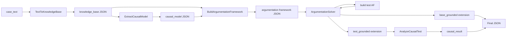

# Arquitetura do Sistema

Sistema híbrido que combina DSPy (para estruturar e guiar LLMs) com um solver formal de argumentação defeasible (ASPIC+) para determinar relações de causa-em-fato em casos de direito do consumidor.

## Visão Geral

```
Texto do Caso → Extração de Base de Conhecimento → Modelagem Causal
              → Construção de Framework de Argumentação → Cálculo de Extensão Fundamentada
              → Análise Causal Contrafactual → Resultado Final
```

Cada etapa transforma a representação do caso:

1. **Extração**: Texto em prosa → Base de conhecimento estruturada (premissas, causas potenciais, conclusão alvo)
2. **Modelagem**: Base de conhecimento → Modelo causal (regras defeasible, preferências)
3. **Argumentação**: Modelo causal → Framework completo (argumentos, ataques, derrotas)
4. **Solução**: Framework → Extensão fundamentada (argumentos justificados)
5. **Análise**: Extensão fundamentada → Julgamento causal (é causa-em-fato?)

## Componentes

### DSPy Signatures (`src/signatures.py`)

Definem os contratos de entrada/saída entre módulos:

| Signature | Entrada | Saída |
|---|---|---|
| `TextToKnowledgeBase` | Texto do caso | JSON com premissas, causas, conclusão alvo |
| `ExtractCausalModel` | Base de conhecimento | JSON com regras defeasible, undercutters, preferências |
| `BuildArgumentationFramework` | KB + modelo causal | JSON com argumentos, ataques, derrotas |
| `AnalyzeCausalTest` | Extensão + causa potencial | `is_cause` booleano + explicação |
| `BoardgameKBExtraction` | Texto do caso + goal | Premissas + conclusão alvo (BoardgameQA) |
| `BoardgameRuleExtraction` | Texto + KB | Regras com preferências (BoardgameQA) |

### Solver ASPIC+ (`src/solver.py`)

Implementação do framework de argumentação estruturada:

- **`Literal`** — representa literais (fatos atômicos e suas negações)
- **`Rule`** — representa regras defeasible e estritas (premissas → conclusão)
- **`Argument`** — representa argumentos como cadeias de inferência
- **`Attack`** — representa ataques entre argumentos (undermine, undercut, rebut)
- **`ArgumentationFramework`**:
  - Constrói argumentos a partir de premissas e regras (iteração até ponto fixo)
  - Identifica ataques entre argumentos
  - Calcula derrotas com base em preferências
  - Expõe `compute_grounded_extension()` para calcular a extensão fundamentada

### Módulos DSPy (`src/modules.py`, `src/boardgame_module.py`)

- **`CausalReasoningPipeline`** — pipeline completo para análise jurídica causal
- **`BoardgamePipeline`** — módulo compilável para benchmark BoardgameQA
- **`ArgumentationSolver`** — integra o solver formal como `dspy.Tool`

### Runner (`src/pipeline.py`)

- `run_boardgame_tests` — executa benchmark com suporte a resume, tracing e Langfuse
- `run_legal_analysis` — executa análise de casos jurídicos do `GOLDEN_DATASET`

## Fluxos

### Pipeline Jurídico (Legal Mode)



### Pipeline BoardgameQA

```
case_text + goal_str
    → BoardgameKBExtraction   (LLM)  → premises + target_conclusion
    → BoardgameRuleExtraction (LLM)  → defeasible_rules + preferences
    → ArgumentationFramework  (solver determinístico)  → grounded extension
    → _map_label              (matching)  → "proved" | "disproved" | "unknown"
```

## Contratos de Dados

### knowledge_base (JSON)
```json
{
  "premises": ["Produto_Anunciado_AprovaAgua", "Produto_Caiu_Piscina"],
  "potential_causes": ["Produto_Anunciado_AprovaAgua"],
  "target_conclusion": "Dever_Reparo",
  "axioms": []
}
```

### causal_model (JSON)
```json
{
  "defeasible_rules": [
    {"id": "r1", "premises": ["Produto_Anunciado_AprovaAgua"], "conclusion": "Produto_Defeituoso"}
  ],
  "undercutter_rules": [],
  "strict_rules": [],
  "preferences": {"r1": "r2"}
}
```

### Resultado do Solver
```json
{
  "grounded_extension": ["A1", "A3"],
  "explanations": {
    "A1": {"support_set": ["r1"], "defeated_by": []}
  }
}
```

## Semântica Grounded

A implementação utiliza semântica grounded por:

- **Unicidade**: Sempre existe uma única extensão fundamentada
- **Natureza cética**: Apropriada para raciocínio judicial onde incerteza é comum
- **Eficiência**: Algoritmo de ponto fixo é computacionalmente tratável

## Análise Contrafactual

Para determinar causa-em-fato:
1. Calcula extensão fundamentada do caso base
2. Para cada causa potencial, nega a causa (axioma contrafactual)
3. Reconstrói framework com a causa negada
4. Compara extensões: se `target_conclusion` sair da extensão, a causa é necessária (causa-em-fato)

## Exemplo: Celular à Prova d'Água

**Texto**: "Comprei um celular anunciado como à prova d'água. Caiu na piscina e parou de funcionar."

**Argumentos**:
- `A1`: `[Produto_Anunciado_AprovaAgua, r1, r2]` → `Dever_Reparo`
- `A2`: `[Empresa_Alegou_Mau_Uso, r3]` → `Nao_Aplica_Garantia` (undercuts A1)

Se `A2` derrota `A1`, `Produto_Anunciado_AprovaAgua` **não** é causa-em-fato para `Dever_Reparo`.
